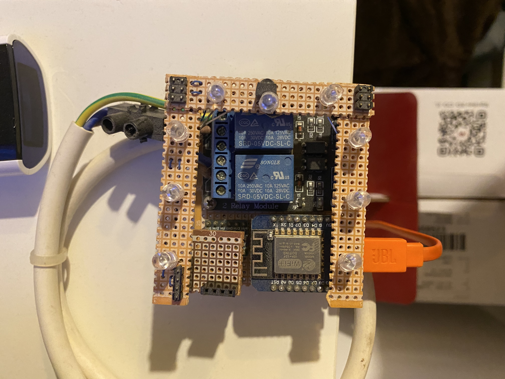

# Room control box / Smart room controller

This project will turn your room into a smart room by controlling all of your infrared controlled appliances using a web interface.
Place this prototype in a visible area of your room and configure a few infrared codes to control the TV, sound amplifier, an infrared controlled light bulb, air conditioner and mush more.
You can even control two channels of high voltage electrical appliances. In my case I control the shades in my room (1 channel to get them up and the other to get them down).
Connect to your Spotify account using their API to automate playing songs at the start of your day.
The program creates an API (which can be used with or without the user interface) to allow you to control your room using Smart assistants like Apple's Siri or Amazon's Alexa.
The API also allows you to control certain settings of the project.
The expected target audience is any lazy user who wants to automate pressing physical buttons with a basic understanding of electronics, microcontrollers, C programming and web development.

[Warning] If you do not have experience handling high voltage appliances or you are not familiar with your regional electrical standards (which is mostly required by law), I highly recommend you do not use the high voltage features of this project as it can be extremely dangerous.
This web interface/server has no security setting built into it, if you are planning to allow access to the website from an external network you might want to consider setting up an authentication method.

### Main features of the project

- Using only a few cheap electronic components you can turn your room to a smart room with customizable preferences.
- Control your room's electrical appliances using the API webpage.
- Connect to the webpage using a local mDNS server (simply go to smartroom.local on your browser after setup).
- Control your Tadiran air conditioner settings such as power, mode, temperature, fan.
- Control 2 channels of high voltage (up to 220 volts AC) appliances using relays.
- Using infrared receiver allows you to control the high voltage devices as well.
- Connect to your Spotify account to automate playing songs in a certain device.

### Components required

1. 1 Wemos D1 mini (or any similar ESP32 based microcontroller)
2. 1 Infrared receiver
3. 2 220V relays (or one module with two channels).
4. 9 Infrared LEDs (you can use less but make sure the infrared coverage is enough).

### Schematic diagram

                           
To supply power to the circuit you can use the Wemos D1 USB connector.
The high voltage power supply will be connected only to the relay.

### Description of the system

The Wemos D1 mini is being used to run a web server that will provide the user interface and API access, and also to control the I/O pins connected to the infrared LEDs and relays.

The microcontroller also continuously reads the infrared receiver and controls the high voltage appliances accordingly.

The user control data arrives from the from the client as a string of infrared code which is then being sent to the infrared LEDs.

Interfacing with the Spotify API is being set up using the web interface, after setup a user command that is being sent to the microcontroller will be forwarded to the Spotify API (the ESP32 holds the security token required to interface with it).

## Code

Code is available [here](Code/Arduino)

Webpage files are located [here](Code/Webpage)

Notice: You'll need to transfer the webpage files (HTML, CSS and JS) to the SPIFFs of the ESP32 using the FTP server.

### Watch this project in action

Examine this demo video

 
